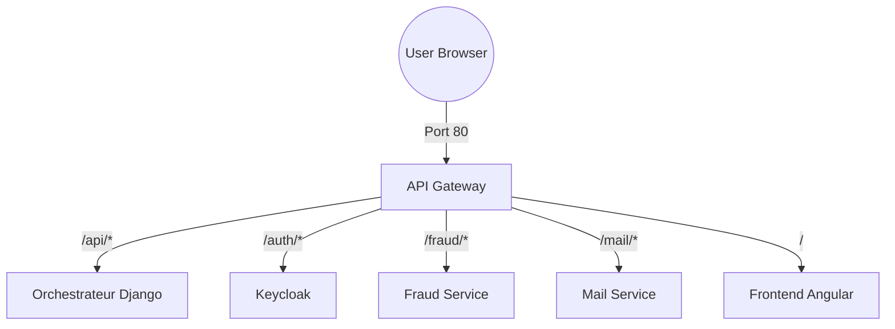

# 🌐 API Gateway (Nginx) — Architecture & Routing Guide

This document explains how the Nginx container acts as the central traffic controller for the BankChat project.

## 🚀 1. The Big Picture
In a microservices architecture, the frontend shouldn't need to know the IP addresses of 5 different backend services. The **API Gateway** provides a **Single Entry Point** (port 80).

The browser talks to **one** host (localhost), and Nginx decides where each request goes based on the URL path.



---

## 🗺️ 2. The Routing Map

| Path Prefix | Destination Service | Port | Primary Responsibility |
| :--- | :--- | :--- | :--- |
| `/api/v1/` | `orchestrateur` | 8000 | Chat logic, Database access, History |
| `/auth/` | `keycloak` | 8080 | Login, Token issuance, User roles |
| `/fraud/` | `fraud-service` | 8001 | Transaction analysis, Report generation |
| `/mail/` | `mail-service` | 8002 | Sending alerts and reports via email |
| `/` | `frontend` | 80 | Serving the Angular SPA (HTML/JS/CSS) |

---

## 🛠️ 3. Key Concepts in `nginx.conf`

### Upstream Blocks
Instead of hardcoding IPs, we define groups of servers. Nginx uses Docker's internal DNS to resolve names like `orchestrateur` to the current container IP.
```nginx
upstream orchestrateur_backend {
    server orchestrateur:8000;
    keepalive 32; # Keeps connections open to improve performance
}
```

### Proxy Headers
Nginx "translates" the request. It adds headers so the backend knows the original user's IP, which is crucial for logging and security.
*   `Host`: Passes the original hostname (e.g., localhost).
*   `X-Real-IP`: The client's IP address.
*   `X-Forwarded-Proto`: Tells the backend if the user used HTTP or HTTPS.

### Streaming Support (SSE)
For the chatbot to reply "token by token" in real-time, Nginx must **not** wait for the whole message to finish.
```nginx
location /api/ {
    proxy_buffering off;        # Don't buffer the response
    proxy_request_buffering off;
    proxy_http_version 1.1;     # Required for streaming
}
```

---

## 🔍 4. Troubleshooting the "502 Bad Gateway"
The most common issue in this project is the `502 Bad Gateway` (Host is unreachable).

### Why it happens:
1.  **Container IP Shift:** When you run `docker-compose up`, Docker assigns internal IPs (e.g., `172.19.0.5`). 
2.  **DNS Caching:** Nginx resolves the name `orchestrateur` once when it starts. 
3.  **The Breakdown:** If you restart only the `orchestrateur`, it might get a new IP (e.g., `172.19.0.8`). If Nginx isn't restarted, it keeps trying the old IP, leading to a "Host is unreachable" error.

### The Fix:
Always restart the gateway if you suspect IPs have changed:
```bash
docker restart bank_chat_gateway
```

---

## 🔐 5. Security & CORS
The gateway handles some cross-origin settings, ensuring the Frontend at port 4200 can safely communicate with the Backend services without browser security blocks. 

It also ensures that any request to `/api` or `/fraud` carries the `Authorization` header through to the backend for token validation.
